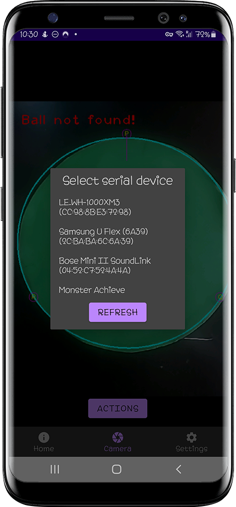

<h1 align="center">PiPo BALLUS balancing PID table</h1>

    

    

        
        
        
        
        
    

## Table of contents

- [What is it?](#what-is-it)
- [Android application](#android-application)

----------

## What is it?

PiPo-Ballus is a smart table that can stabilize and balance a ball (for example, a ping-pong ball). The first version (removed from GitHub) used only 2 servos. The current version uses 3 servos and a conversion of the Cartesian coordinate system (like on a delta 3D printer).

----------

## Android application

Description coming soon

    

        
        
    

    

        
        
    

    

        
    

